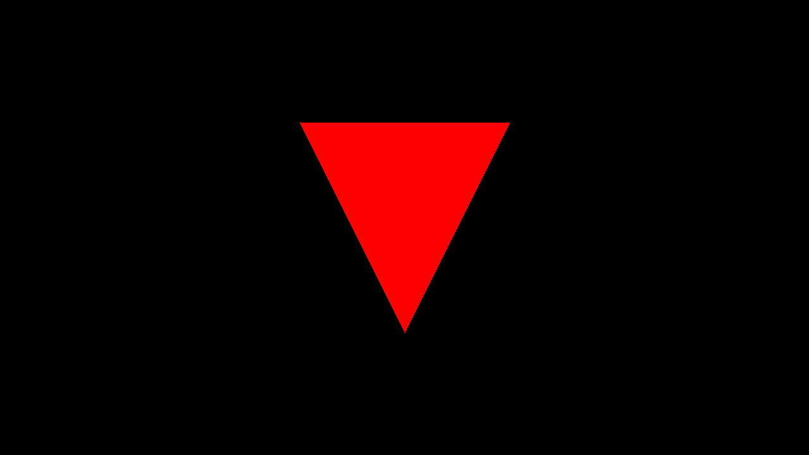

# Advanced Mathematics for CG Exam Report – 26/01/2022 
# By David Owairu

## Stage 1:Trace Triangle.

I decided to use C++ and SDL2 as the basis for my program and made use of visual studio as my development environment for easy linking of libraries and program execution. I setup an SDL window, renderer, and loop to get a window up on screen and added functionality to save and image once all procedures have been executed. I also made use of GMTL(Generic Math Template Library) to handle all my Vector/point math and operations, this was primarily to save time.

Once setup was complete, I started creating the most basic structs. I created structs for colours and polygons as a base. For us to raytrace the triangle, we need to be able to shoot a ray and detect a hit. I added an additional hit struct to handle storing values related to hit detection. Shooting the rays involved looping through every pixel in our window context and shooting a ray from the camera origin(0,0,0) to that pixel. I initially tried to use the geometric method for calculating ray triangle intersection but ran into problems with my inside-outside tri calculation which handled hit detection. I ended up using the Moller Trumbore algorithm for triangle intersection instead. I had to modify a few parts to align it to the structure of my program and my hit struct .Once this was all setup it was as easy as setting up a function to load/set the values for a single Tri and pass it into the raytracing function to be rendered. Then finally setting a colour on whatever pixel detects a hit.

Single Tri

## Stage 2: Read Triangles from File.

I was quite unfamiliar with file parsing in C++ so I had to do a little bit of research here to figure out what the quickest/most ideal method would be to read in all the triangles. First, I had to include fstream and sstream to that I would be able to read the file and work on the strings in the file. The first step was setting a file stream variable and opening the file, then for testing purposes I setup three string vectors “polygon”, ”vert” and “coord” that I would store the parsed values in, print and compare their order to the original file to ensure it was correct.

The parse involved using the “getline” function and three while loops for the three levels of seperation line ,space and comma. The first while loop goes through every line and adds the string to the “triangle” vector. The second while loop goes through each space and adds the string to the vert vector and finally the third loop does the same adding it into the coord vector.

Once I confirmed everything was properly stored and read in the correct order, I moved onto Converting values. I added extra lines of code in the last loop that would convert each of the coord strings into a float and store them in a point variable. In the loop above I then have a set of if statements that based on the current loop(kept track using a counter) would add those “coords” to a “vert” in a predefined triangle variable. Finally, we add each triangle to the “polygon” vector(this one is a vector of type polygon instead of string).

## Stage 3: Trace Full Object.

This stage mostly involved function encapsulation and moving the code around so that it would work with the new “list” of Triangles. I started by encapsulating all the file parse code in to my previous “loadverts” function and returning the resulting polygon vector. That polygon vector is than passed on to the raytrace function. In the raytrace function I calculate the size of the polygon vector i.e., the number of elements. I then iterate over the loop checking for intersection over a differ poly each time. Initially I had a problem where the program would either calculate all the polygons and only render the last polygon or it render the fist polygon and not calculate the rest. This was because I forgot to add the check for returning polygon that we hit. I return a value only when the intersection function sets the hit value to true.

<i>Fully render object with constant colour</>

## Stage 4: Simple Shading and Lighting.

I started by implementing a basic diffuse shading with one light and no specular or ambient light. Implementing the light was straight forward. I created a struct for the light with position, colour and intensity then passed that light into the raytrace function along with the polygons. Most of the modification was in the if-statement for whether a polygon is hit, this is where all my lighting/shading calculation is done. I started by calculating the incident light on the surface, then using the Lambertian shading model for diffuse we calculate the reflectance by multiplying the light intensity by the dot product of the surface normal and light direction vectors. The result is lastly multiplied by our surface colour to get the diffuse.

For Specular highlight I calculated a basic specular using the incident light, view vector , surface normal and the light vector. With these values and a basic specular formula, we can calculate the specular reflection value and add it to our existing colour value.

## Stage 5: Casting Shadow Rays.

The shadows were relatively straight forward to achieve. I already had all the building blocks to easily calculate the

shadows. I had the ability to trace rays , detect whether they hit anything and return a value based on this. So, I

created another loop within my “Tracepoly” function that would cast a ray from the current polygon and check for

intersection with all other polygons. I configured it so that once it hits anything it breaks the loop and continues with

the proper lighting calculations.

The way I determine whether the ray hit anything is to compare the distance from the light to the object and

compare it to the distance of the ray. If the ray is less that the distance of the light, then it was blocked by something

hence the current polygon will be in shadow. Finally, if shadow is detected in a polygon, we multiply the colour by a

very small value to make it pretty much black and don’t calculate specular.

# Final Images

Final Images are in 1600x900 and rendered in approx. 46mins.

## Reference list – all references also included in code

cppreference (2022). operator overloading - cppreference.com. [online] en.cppreference.com. Available at:
https://en.cppreference.com/w/cpp/language/operators [Accessed 26 Jan. 2022].

dev, O. (n.d.). Tutorial 19 - Specular Lighting. [online] ogldev.org. Available at:
https://ogldev.org/www/tutorial19/tutorial19.html [Accessed 26 Jan. 2022].

ggt.sourceforge.net. (2010). GenericMathTemplateLibrary: gmtl Namespace Reference. [online] Available at:
http://ggt.sourceforge.net/gmtlReferenceGuide-0.6.1-html/namespacegmtl.html#af3cfac0b6f428e50cc92d2d2b6affae9 [Accessed 27 Jan. 2022].

Sanmukhani, R. (2016). c++ - Splitting input string based on whitespace and commas. [online] Stack Overflow. Available at: https://stackoverflow.com/questions/36974817/splitting-input-string-based-on-whitespace-and-commas [Accessed 25 Jan. 2022].

Scratchapixel (2014a). Introduction to Shading (Diffuse and Lambertian Shading). [online] Scratchapixel.com. Available at: https://www.scratchapixel.com/lessons/3d-basic-rendering/introduction-to-shading/diffuse-lambertian-shading [Accessed 25 Jan. 2022].

Scratchapixel (2014b). Introduction to Shading (Lights). [online] Scratchapixel.com. Available at:https://www.scratchapixel.com/lessons/3d-basic-rendering/introduction-to-shading/shading-lights [Accessed 25 Jan. 2022].

Scratchapixel (2014c). Ray Tracing: Rendering a Triangle (Geometry of a Triangle). [online] www.scratchapixel.com. Available at: https://www.scratchapixel.com/lessons/3d-basic-rendering/ray-tracing-rendering-a-triangle/geometry-of-a-triangle [Accessed 24 Jan. 2022].

Scratchapixel (2014d). Ray Tracing: Rendering a Triangle (Möller-Trumbore algorithm). [online] www.scratchapixel.com. Available at: https://www.scratchapixel.com/lessons/3d-basic-rendering/ray-tracing-rendering-a-triangle/moller-trumbore-ray-triangle-intersection [Accessed 24 Jan. 2022].

Scratchapixel (2014e). Ray Tracing: Rendering a Triangle (Ray-Triangle Intersection: Geometric Solution). [online] Scratchapixel.com. Available at: https://www.scratchapixel.com/lessons/3d-basic-rendering/ray-tracing-rendering-a-triangle/ray-triangle-intersection-geometric-solution [Accessed 24 Jan. 2022].

Sratchapixel (2014). Introduction to Shading (Light and Shadows). [online] www.scratchapixel.com. Available at:https://www.scratchapixel.com/lessons/3d-basic-rendering/introduction-to-shading/ligth-and-shadows [Accessed 26 Jan. 2022].

TwilightSpectre (2014). c++ operator overloading, division - C++ Forum. [online] www.cplusplus.com. Available at:http://www.cplusplus.com/forum/general/130110/ [Accessed 26 Jan. 2022].
